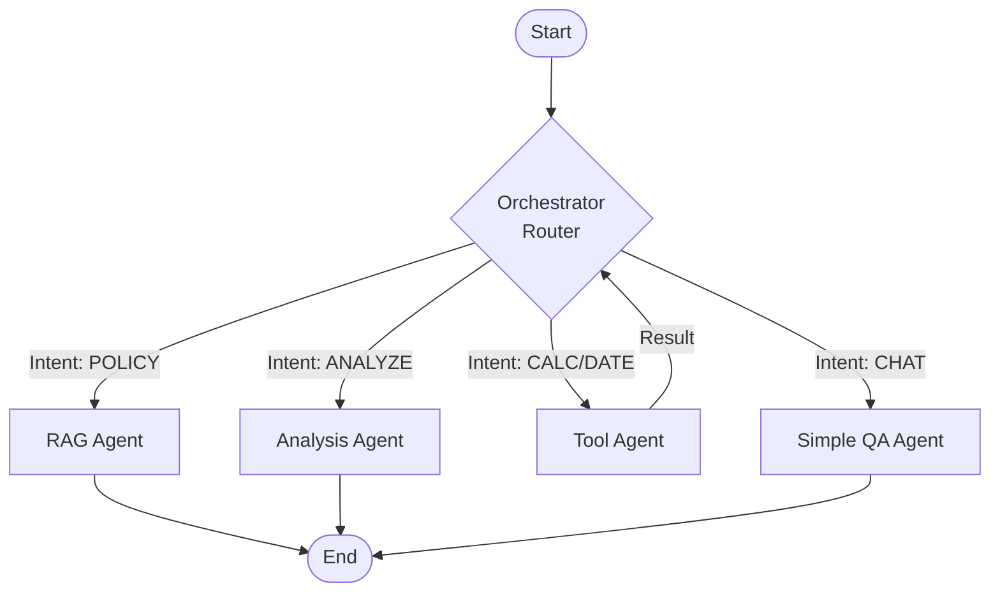
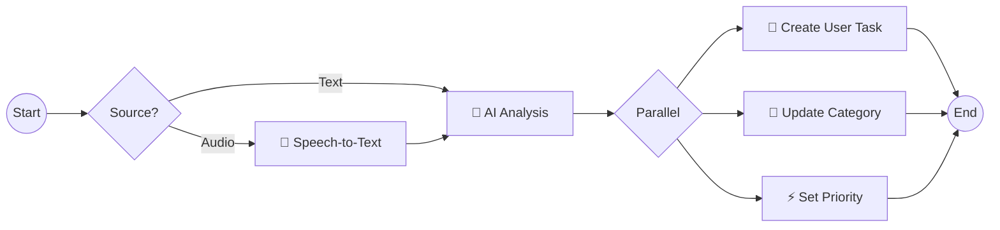

# 📚 BPM Systems: Enterprise Intelligent Automation Platform

**Comprehensive Technical Documentation**

> **A Complete Guide to the Hybrid AI-BPM Architecture**
> Combining Java Spring AI (Performance Core) + Python LangGraph (Cognitive Brain) + Flowable BPM (Orchestration Engine)

---

## 📋 Table of Contents

### [🌟 Part I: Introduction & Architecture](#-part-i-introduction--architecture)

1. [Project Overview](#1-project-overview)
2. [The "Two Brains" Philosophy](#2-the-two-brains-philosophy)
3. [Global Architecture](#3-global-architecture)
4. [Technology Stack](#4-technology-stack)
5. [Key Features](#5-key-features)
6. [System Requirements](#6-system-requirements)
7. [Quick Start Guide](#7-quick-start-guide)

### [☕ Part II: Java BPM Agent (Performance Core)](#-part-ii-java-bpm-agent-performance-core)

1. [Architecture Overview](#1-architecture-overview)
2. [Spring AI Framework](#2-spring-ai-framework)
3. [RAG Implementation](#3-rag-implementation)
4. [Real-time Visualization](#4-real-time-visualization)
5. [Gemini API Integration](#5-gemini-api-integration)
6. [Vector Store Integration](#6-vector-store-integration)
7. [API Endpoints](#7-api-endpoints-java)
8. [Configuration](#8-configuration-java)
9. [Data Flow](#9-data-flow-java)
10. [Development Guide](#10-development-guide-java)

### [🐍 Part III: Python BPM Agent (Cognitive Brain)](#-part-iii-python-bpm-agent-cognitive-brain)

1. [Architecture Overview](#1-architecture-overview-python)
2. [LangGraph Multi-Agent System](#2-langgraph-multi-agent-system)
3. [Agent Types & Capabilities](#3-agent-types--capabilities)
4. [Orchestrator & Routing](#4-orchestrator--routing)
5. [RAG System](#5-rag-system)
6. [PDF Processing Pipeline](#6-pdf-processing-pipeline)
7. [Speech Processing (Whisper)](#7-speech-processing-whisper)
8. [Sentiment Analysis](#8-sentiment-analysis)
9. [Tool System](#9-tool-system)
10. [API Endpoints](#10-api-endpoints-python)
11. [Configuration](#11-configuration-python)
12. [Data Flow](#12-data-flow-python)
13. [Development Guide](#13-development-guide-python)

### [🔄 Part IV: Flowable BPM Integration](#-part-iv-flowable-bpm-integration)

1. [Flowable Overview](#1-flowable-overview)
2. [Process Definitions](#2-process-definitions)
3. [LangGraph BPMN Workflow](#3-langgraph-bpmn-workflow)
4. [Service Tasks](#4-service-tasks)
5. [User Tasks & Routing](#5-user-tasks--routing)
6. [Deployment](#6-deployment-flowable)
7. [Testing](#7-testing-flowable)

### [🔌 Part V: API Reference](#-part-v-api-reference)

1. [Java REST API](#1-java-rest-api)
2. [Python REST API](#2-python-rest-api)
3. [LangGraph API](#3-langgraph-api)
4. [Flowable REST API](#4-flowable-rest-api)
5. [Request/Response Examples](#5-requestresponse-examples)

### [🚀 Part VI: Deployment & Infrastructure](#-part-vi-deployment--infrastructure)

1. [Docker Setup](#1-docker-setup)
2. [Qdrant Configuration](#2-qdrant-configuration)
3. [Environment Variables](#3-environment-variables)
4. [Production Deployment](#4-production-deployment)
5. [Monitoring & Logging](#5-monitoring--logging)
6. [Performance Tuning](#6-performance-tuning)

### [🔧 Part VII: Development & Contributing](#-part-vii-development--contributing)

1. [Development Setup](#1-development-setup)
2. [Project Structure](#2-project-structure)
3. [Coding Standards](#3-coding-standards)
4. [Testing Guidelines](#4-testing-guidelines)
5. [Contributing](#5-contributing)

### [❓ Part VIII: Troubleshooting & FAQ](#-part-viii-troubleshooting--faq)

1. [Common Issues](#1-common-issues)
2. [Debug Guide](#2-debug-guide)
3. [FAQ](#3-faq)
4. [Support](#4-support)

---

# 🌟 Part I: Introduction & Architecture

## 1. Project Overview

### What is BPM Systems?

BPM Systems is an **enterprise-grade intelligent automation platform** that seamlessly combines:

- **Traditional BPM (Business Process Management)** for structured, deterministic workflows
- **Modern AI Agents** for cognitive, context-aware decision making
- **RAG (Retrieval Augmented Generation)** for knowledge-grounded responses
- **Multi-Agent Orchestration** for complex task routing

Unlike traditional RPA (Robotic Process Automation) that blindly follows rules, this system **thinks**. It understands:

- **Intent**: What the user actually wants
- **Context**: Historical data, company policies, current situation
- **Sentiment**: User emotion and urgency (without confusing anger with urgency)
- **Complexity**: Whether a task needs simple QA, document search, complex analysis, or tool execution

### Real-World Use Cases

1. **Customer Support Automation**
   - Automatic ticket categorization (TECH_SUPPORT, BILLING, HR)
   - Priority routing based on actual urgency (not just keywords)
   - RAG-powered policy lookups with citations
   - Multi-language support (Turkish, English)

2. **HR Process Automation**
   - Leave request processing
   - Policy question answering
   - Employee onboarding workflows
   - Performance review scheduling

3. **Document-Heavy Processes**
   - Contract analysis
   - Compliance checking
   - Policy search and explanation
   - Automatic summarization

4. **Phone Call Intelligence**
   - Speech-to-text transcription (Whisper)
   - Emotion detection from speech patterns
   - Automatic call categorization
   - Text-to-speech responses

---

## 2. The "Two Brains" Philosophy

This project employs a unique **dual-brain architecture** to maximize both performance and flexibility:

### 🧠 Brain 1: Java BPM Agent (Performance Core)

**Role:** High-performance, type-safe core for RAG and real-time visualization

**Strengths:**

- ⚡ Speed: Java's JIT compilation and native threading
- 🔒 Type Safety: Compile-time error checking
- 🏢 Enterprise Ready: Spring Boot ecosystem, dependency injection
- 📊 Real-time Visualization: WebSocket events for every RAG step
- 🔗 Integration: Native gRPC support for Qdrant

**Technology:**

- Java 17+ with Records
- Spring Boot 3.4.1
- Spring AI 1.0.0-M6
- Gemini 2.5 Flash
- Qdrant Vector Store (gRPC port 6334)
- WebSocket (STOMP protocol)

**Use Cases:**

- High-throughput RAG queries
- Real-time visualization dashboard
- Production RAG deployments
- Document indexing pipelines

---

### 🐍 Brain 2: Python BPM Agent (Cognitive Orchestrator)

**Role:** Cognitive orchestrator handling complex reasoning, multi-agent conversations, and dynamic task routing

**Strengths:**

- 🎯 Flexibility: Dynamic typing, rapid prototyping
- 🤖 AI Native: Extensive ML/NLP libraries
- 🔀 Graph-Based Logic: LangGraph state machines
- 🎤 Speech Processing: Native Whisper integration
- 🛠️ Tooling: Rich ecosystem for data processing

**Technology:**

- Python 3.10+
- FastAPI 0.109
- LangGraph 0.2.60
- LangChain 0.3.13
- Gemini 2.5 Flash + text-embedding-004
- Qdrant (HTTP port 6333)
- OpenAI Whisper
- Flowable REST API

**Use Cases:**

- Multi-agent orchestration
- Complex decision trees
- Speech processing pipelines
- Tool calling and automation
- Flowable BPM integration

---

## 3. Global Architecture

```
┌────────────────────────────────────────────────────────────────────────────┐
│                          🌐 USER INTERFACES                                 │
│                                                                             │
│   Web UI       Phone Call       REST API       Flowable Modeler           │
│     │              │                │                 │                     │
└─────┼──────────────┼────────────────┼─────────────────┼─────────────────────┘
      │              │                │                 │
      ▼              ▼                ▼                 ▼
┌────────────────────────────────────────────────────────────────────────────┐
│                          ⚡ API GATEWAY LAYER                              │
│                                                                             │
│   Nginx / Kong / AWS API Gateway (Optional)                               │
│   - Load Balancing                                                         │
│   - Rate Limiting                                                          │
│   - Authentication                                                         │
└─────────────────────────────┬──────────────────────────────────────────────┘
                              │
              ┌───────────────┴───────────────┐
              │                               │
              ▼                               ▼
┌──────────────────────────┐    ┌──────────────────────────┐
│   ☕ JAVA BRAIN          │    │   🐍 PYTHON BRAIN        │
│   (Performance Core)      │    │   (Cognitive Brain)       │
│                           │    │                           │
│  ┌──────────────────────┐│    │┌──────────────────────────┐
│  │ Spring Boot API      ││    ││ FastAPI Server           │
│  │ Port: 8081           ││    ││ Port: 8000               │
│  └──────────────────────┘│    │└──────────────────────────┘
│                           │    │                           │
│  ┌──────────────────────┐│    │┌──────────────────────────┐
│  │ Spring AI RAG        ││    ││ LangGraph Orchestrator   │
│  │ - ChatClient         ││    ││ - Multi-Agent Router     │
│  │ - QuestionAnswerAdv  ││    ││ - State Management       │
│  │ - VectorStore        ││    ││ - Conditional Edges      │
│  └──────────────────────┘│    │└──────────────────────────┘
│                           │    │                           │
│  ┌──────────────────────┐│    │┌──────────────────────────┐
│  │ RagVisualizationSvc  ││    ││ 4 Specialized Agents     │
│  │ - WebSocket Events   ││    ││ - RAG_AGENT             │
│  │ - Step-by-Step View  ││    ││ - SIMPLE_QA_AGENT       │
│  └──────────────────────┘│    ││ - ANALYSIS_AGENT        │
│                           │    ││ - TOOL_AGENT            │
│  ┌──────────────────────┐│    │└──────────────────────────┘
│  │ Gemini Integration   ││    │                           │
│  │ - GeminiChatModel    ││    │┌──────────────────────────┐
│  │ - GeminiEmbedding    ││    ││ Speech Processing        │
│  └──────────────────────┘│    ││ - Whisper STT           │
│             │             │    ││ - Sentiment Analysis    │
└─────────────┼─────────────┘    │└──────────────────────────┘
              │                   │                           │
              │                   │┌──────────────────────────┐
              │                   ││ Tool Executor (MCP)      │
              │                   ││ - 10 Built-in Tools     │
              │                   │└──────────────────────────┘
              │                   │             │
              │                   └─────────────┼─────────────┘
              │                                 │
              │        ┌────────────────────────┘
              │        │
              ▼        ▼
┌────────────────────────────────────────────────────────────────────────────┐
│                          💾 DATA & INFRASTRUCTURE                          │
│                                                                             │
│  ┌─────────────────────┐  ┌─────────────────────┐  ┌────────────────────┐ │
│  │   QDRANT VECTOR DB   │  │   FLOWABLE BPM      │  │   POSTGRES DB      │ │
│  │                      │  │                      │  │                    │ │
│  │ Port 6333 (HTTP)     │  │ Port 8080           │  │ Port 5432          │ │
│  │ Port 6334 (gRPC)     │  │                      │  │                    │ │
│  │                      │  │ - Process Engine    │  │ - Flowable Tables  │ │
│  │ Collection:          │  │ - Task App          │  │ - User Data        │ │
│  │   bpm_documents      │  │ - Modeler           │  │ - History          │ │
│  │   bpm_policies       │  │ - Admin Console     │  │                    │ │
│  │                      │  │                      │  │                    │ │
│  │ 768-dim Embeddings   │  │ BPMN 2.0 Workflows  │  │                    │ │
│  │ Cosine Similarity    │  │ Service Tasks       │  │                    │ │
│  └─────────────────────┘  └─────────────────────┘  └────────────────────┘ │
└────────────────────────────────────────────────────────────────────────────┘
                                     │
                                     ▼
                          ┌───────────────────────┐
                          │   GOOGLE GEMINI API    │
                          │                        │
                          │ - Chat (2.5 Flash)    │
                          │ - Embedding (004)     │
                          └───────────────────────┘
```

### Data Flow Example: Customer Question

```
1. User asks: "What is the vacation policy for remote workers?"

2. Request hits Python Brain (FastAPI)

3. LangGraph Orchestrator analyzes:
   - Keywords detected: "policy", "vacation"
   - Routes to: RAG_AGENT

4. RAG_AGENT workflow:
   ├─ Generate embedding (768-dim vector)
   ├─ Search Qdrant (bpm_policies collection)
   ├─ Retrieve top 5 chunks (threshold: 0.3)
   ├─ Re-rank by relevance + chunk type + position
   └─ Build context (max 2000 tokens)

5. Call Gemini 2.5 Flash:
   System: You are a BPM policy expert
   Context: [5 document chunks]
   Question: "What is the vacation policy..."

6. Response generated with citations:
   "According to the company policy (source: vacation_policy.pdf, page 3),
    remote workers are entitled to 20 days of paid vacation per year..."

7. Python sends to Flowable (optional):
   - Start process: langgraphAIIntakeProcess
   - Variables: {question, answer, category: HR, priority: MEDIUM}

8. Flowable executes workflow:
   ├─ Parse Response (JavaScript)
   ├─ Update Category → HR
   ├─ Set Priority → MEDIUM
   ├─ Create Task → HRTeam
   └─ Store to Qdrant (for future retrieval)

9. User receives answer + task created
```

---

## 4. Technology Stack

### Backend Frameworks

| Component | Java Stack | Python Stack |
|-----------|------------|--------------|
| **Framework** | Spring Boot 3.4.1 | FastAPI 0.109.0 |
| **Server** | Embedded Tomcat | Uvicorn 0.27.0 |
| **DI Container** | Spring IoC | N/A |
| **Validation** | Jakarta Validation | Pydantic 2.5.3 |
| **Async** | Spring WebFlux | asyncio |

### AI & ML

| Component | Technology | Version |
|-----------|------------|---------|
| **LLM** | Google Gemini 2.5 Flash | Latest |
| **Embedding** | Gemini text-embedding-004 | 768 dimensions |
| **AI Framework (Java)** | Spring AI | 1.0.0-M6 |
| **AI Framework (Python)** | LangChain + LangGraph | 0.3.13 + 0.2.60 |
| **Speech-to-Text** | OpenAI Whisper | Base model |
| **Text-to-Speech** | Google TTS | 2.5.4 |

### Data & Storage

| Component | Technology | Usage |
|-----------|------------|-------|
| **Vector DB** | Qdrant | Semantic search |
| **Relational DB** | PostgreSQL | Flowable data |
| **Document Processing** | pdfplumber, pypdf | PDF parsing |
| **Caching** | In-memory | (Optional: Redis) |

### Workflow & Orchestration

| Component | Technology | Version |
|-----------|------------|---------|
| **BPM Engine** | Flowable | All-in-One |
| **Process Design** | BPMN 2.0 | Standard |
| **Graph Workflows** | LangGraph | 0.2.60 |

### Communication

| Component | Technology | Usage |
|-----------|------------|-------|
| **REST API** | Spring Web, FastAPI | Synchronous |
| **WebSocket** | Spring WebSocket (STOMP) | Real-time events |
| **gRPC** | Qdrant gRPC (Java) | High-performance |
| **HTTP Client** | Spring WebFlux, httpx | API calls |

---

## 5. Key Features

### ✨ Core Features

1. **Intelligent Request Routing**
   - Automatic agent selection based on intent
   - Keyword + LLM-based routing
   - Fallback mechanisms

2. **RAG (Retrieval Augmented Generation)**
   - PDF document ingestion
   - Semantic chunking (500 tokens, 100 overlap)
   - Hybrid search (semantic + keyword)
   - Citation support
   - Multi-level re-ranking

3. **Multi-Agent Orchestration**
   - RAG Agent: Document Q&A
   - Simple QA Agent: General questions
   - Analysis Agent: Chain of Thought reasoning
   - Tool Agent: Function calling (10 tools)

4. **Speech Processing**
   - Whisper transcription (multi-language)
   - Speaking rate, pitch variance analysis
   - Repetition detection
   - Voice stress indicators

5. **Sentiment Analysis**
   - Emotion detection (HAPPY, FRUSTRATED, ANGRY, ANXIOUS, DESPERATE)
   - Intensity scoring (1-10)
   - Urgency justification (ANGRY ≠ URGENT)
   - Speech pattern integration

6. **Flowable BPM Integration**
   - Visual workflow design
   - Service task automation
   - User task routing (urgent/high/normal)
   - Parallel execution
   - Error handling

7. **Real-time Visualization**
   - WebSocket event stream
   - Step-by-step RAG pipeline
   - Node status (PENDING, PROCESSING, COMPLETED, ERROR)
   - Performance metrics (duration, dimensions, doc count)

### 🔧 Developer Features

- **Type Safety**: Java Records, Pydantic models
- **Validation**: Input validation at every layer
- **Error Handling**: Retry logic, fallbacks, error recovery
- **Logging**: Structured logging with log levels
- **Testing**: Unit tests, integration tests (WIP)
- **Documentation**: Comprehensive inline documentation
- **Hot Reload**: Java (Spring DevTools), Python (Uvicorn --reload)

### 🚀 Production Features

- **Scalability**: Stateless design, horizontal scaling
- **Monitoring**: Health endpoints, metrics (Actuator)
- **Security**: API key management, CORS configuration
- **Performance**: Connection pooling, async operations
- **Containerization**: Docker Compose, Kubernetes-ready

---

## 6. System Requirements

### Development Environment

| Component | Minimum | Recommended |
|-----------|---------|-------------|
| **OS** | macOS 10.15+, Ubuntu 20.04+, Windows 10+ | macOS 12+, Ubuntu 22.04+ |
| **CPU** | 4 cores | 8+ cores |
| **RAM** | 8 GB | 16+ GB |
| **Storage** | 10 GB free | 20+ GB SSD |
| **GPU** | N/A | CUDA-enabled (Whisper speedup) |

### Software Prerequisites

| Software | Version | Purpose |
|----------|---------|---------|
| **Java** | 17+ | Java BPM Agent |
| **Maven** | 3.6+ | Java build tool |
| **Python** | 3.10+ | Python BPM Agent |
| **pip** | Latest | Python package manager |
| **Docker** | 20.10+ | Container runtime |
| **Docker Compose** | 2.0+ | Multi-container orchestration |
| **Git** | 2.30+ | Version control |

### API Keys Required

| Service | Purpose | Free Tier |
|---------|---------|-----------|
| **Google AI Studio** | Gemini Chat + Embeddings | ✅ Yes (60 req/min) |
| **OpenAI** (Optional) | Whisper API, GPT models | ❌ No (pay-as-you-go) |

---

## 7. Quick Start Guide

### Step 1: Clone Repository

```bash
cd ~/Desktop
git clone https://github.com/yourusername/bpm-systems.git
cd bpm-systems
```

### Step 2: Start Infrastructure (Docker)

```bash
# Start Qdrant + Flowable + PostgreSQL
docker-compose up -d

# Verify containers are running
docker ps

# Expected output:
# - qdrant (ports 6333, 6334)
# - flowable (port 8080)
# - postgres (port 5432)
```

### Step 3: Configure Environment Variables

#### Java (.env)

```bash
cd java-bpm-agent
cat > .env << EOF
GEMINI_API_KEY=your_gemini_api_key_here
EOF
```

#### Python (.env)

```bash
cd ../python-bpm-agent
cat > .env << EOF
GEMINI_API_KEY=your_gemini_api_key_here
QDRANT_HOST=localhost
QDRANT_PORT=6333
QDRANT_COLLECTION_NAME=bpm_policies
FLOWABLE_URL=http://localhost:8080
FLOWABLE_USER=admin
FLOWABLE_PASS=test
WHISPER_MODEL=base
BPM_API_URL=http://localhost:8001
EOF
```

### Step 4: Start Java BPM Agent

```bash
cd java-bpm-agent

# Build and run
mvn clean install
mvn spring-boot:run

# Or use JAR
mvn package
java -jar target/java-rag-visualization-0.1.0-SNAPSHOT.jar

# Server will start on http://localhost:8081
# Check health: curl http://localhost:8081/api/rag/health
```

### Step 5: Start Python BPM Agent

```bash
cd python-bpm-agent

# Create virtual environment
python3 -m venv venv
source venv/bin/activate  # On Windows: venv\Scripts\activate

# Install dependencies
pip install -r requirements.txt

# Start server
uvicorn app.main:app --reload --host 0.0.0.0 --port 8000

# Server will start on http://localhost:8000
# Check health: curl http://localhost:8000/api/health
```

### Step 6: Deploy Flowable BPMN

```bash
cd python-bpm-agent
python flowable/deploy_to_flowable.py

# Expected output:
# ✅ Flowable is running!
# 👥 Creating user groups...
# 📦 Deploying: langgraph-ai-intake-process.bpmn20.xml
# ✅ Deployed successfully!
```

### Step 7: Load Sample Data

#### Java (Sample HR Policies)

```bash
curl -X POST http://localhost:8081/api/rag/index/sample
# Response: {"message":"Loaded 6 sample HR documents","count":6}
```

#### Python (Upload PDFs)

```bash
curl -X POST http://localhost:8000/api/v1/langraph/upload-pdf \
  -F "file=@data/policies/vacation_policy.pdf"
```

### Step 8: Test the System

#### Test 1: Simple Question (Java)

```bash
curl -X POST http://localhost:8081/api/rag/query \
  -H "Content-Type: application/json" \
  -d '{"question":"What is the vacation policy?"}'
```

#### Test 2: Multi-Agent (Python)

```bash
curl -X POST http://localhost:8000/api/v1/langraph/chat \
  -H "Content-Type: application/json" \
  -d '{
    "question": "How many vacation days do remote workers get?",
    "agent_type": "auto"
  }'
```

#### Test 3: Flowable Integration

```bash
curl -X POST http://localhost:8000/api/flowable/start-process \
  -H "Content-Type: application/json" \
  -d '{
    "text": "I need help with my expense reimbursement",
    "customer_id": "CUST-001",
    "source": "form"
  }'
```

### Step 9: Access Web UIs

| Service | URL | Credentials |
|---------|-----|-------------|
| **Java RAG Visualization** | <http://localhost:8081> | N/A |
| **Python API Docs** | <http://localhost:8000/docs> | N/A |
| **Flowable Task App** | <http://localhost:8080/flowable-task> | admin / test |
| **Flowable Modeler** | <http://localhost:8080/flowable-modeler> | admin / test |
| **Qdrant Dashboard** | <http://localhost:6333/dashboard> | N/A |

### Step 10: Run Sample Tests

#### Speech Processing Test

```bash
curl -X POST http://localhost:8000/api/call/upload \
  -F "file=@static/audio/sample.wav" \
  -F "customer_id=CUST-123"
```

#### Sentiment Analysis Test

```bash
curl -X POST http://localhost:8000/api/test/analyze \
  -H "Content-Type: application/json" \
  -d '{
    "text": "I have been waiting for 3 days and nobody helped me!",
    "source": "phone"
  }'
```

---

### Verify Installation

Run this checklist:

- [ ] Docker containers running (`docker ps`)
- [ ] Java server responds (`curl http://localhost:8081/api/rag/health`)
- [ ] Python server responds (`curl http://localhost:8000/api/health`)
- [ ] Flowable accessible (`http://localhost:8080/flowable-task`)
- [ ] Qdrant has collections (`curl http://localhost:6333/collections`)
- [ ] BPMN deployed (check Flowable UI → Processes)
- [ ] Sample data loaded (Java + Python)

**Congratulations!** 🎉 Your BPM Systems platform is now running.

---

# ☕ Part II: Java BPM Agent (Performance Core)

## 1. Architecture Overview

The Java BPM Agent is a **high-performance RAG (Retrieval Augmented Generation) system** built with Spring Boot and Spring AI. It demonstrates production-grade patterns for enterprise AI applications.

### Design Principles

1. **Type Safety First**: Leveraging Java 17 Records and strong typing
2. **Dependency Injection**: Spring IoC for loose coupling
3. **Layer Separation**: Controller → Service → Repository pattern
4. **Real-time Transparency**: WebSocket events for observability
5. **Performance**: gRPC for vector operations, reactive HTTP clients

### Project Structure

```
java-bpm-agent/
├── src/main/java/com/bpm/systems/
│   ├── JavaBpmAgentApplication.java       # Spring Boot entry point
│   │
│   ├── config/                            # Configuration layer
│   │   ├── AiConfig.java                  # ChatClient, RAG advisor
│   │   └── WebSocketConfig.java           # STOMP WebSocket
│   │
│   ├── controller/                        # REST API layer
│   │   └── RagController.java             # 7 endpoints
│   │
│   ├── service/                           # Business logic layer
│   │   ├── RagService.java                # Standard RAG
│   │   ├── RagVisualizationService.java   # WebSocket RAG
│   │   ├── DocumentIndexingService.java   # ETL pipeline
│   │   └── RagEventPublisher.java         # WebSocket publisher
│   │
│   ├── gemini/                            # Google Gemini integration
│   │   ├── GeminiChatModel.java           # Chat API
│   │   ├── GeminiResponse.java            # Chat DTO
│   │   ├── GeminiEmbeddingModel.java      # Embedding API
│   │   └── GeminiEmbeddingResponse.java   # Embedding DTO
│   │
│   ├── model/                             # Data models
│   │   ├── QueryRequest.java              # API request
│   │   └── QueryResponse.java             # API response
│   │
│   └── event/                             # WebSocket events
│       └── RagEvent.java                  # Pipeline visualization
│
├── src/main/resources/
│   ├── application.properties             # Configuration
│   └── static/                            # Frontend assets
│       ├── index.html
│       ├── app.js
│       └── styles.css
│
├── pom.xml                                # Maven dependencies
├── .env                                   # Environment variables
└── .gitignore
```

### Component Interaction

```
┌──────────────────┐
│  User / Client   │
└────────┬─────────┘
         │ HTTP POST /api/rag/query-visual
         ▼
┌────────────────────────────────────────────────────────────────┐
│                      RagController                              │
│  - Validates QueryRequest                                       │
│  - Delegates to RagVisualizationService                        │
└────────┬───────────────────────────────────────────────────────┘
         │
         ▼
┌────────────────────────────────────────────────────────────────┐
│                 RagVisualizationService                         │
│                                                                  │
│  Step 1: Publish USER_INPUT event via WebSocket                │
│  Step 2: Call embeddingModel.embed(question)                   │
│  Step 3: Publish EMBEDDING_GENERATION event                    │
│  Step 4: Call vectorStore.similaritySearch(vector)             │
│  Step 5: Publish VECTOR_SEARCH + RETRIEVED_DOCUMENTS events    │
│  Step 6: Build prompt with retrieved context                   │
│  Step 7: Call chatModel.call(prompt) (via GeminiChatModel)     │
│  Step 8: Publish LLM_CALL + RESPONSE_GENERATION events         │
│  Step 9: Return QueryResponse                                  │
└────────┬───────────────────────────────────────────────────────┘
         │
         ├─────────────► RagEventPublisher ──────► WebSocket (/topic/rag-events)
         │                                                │
         │                                                ▼
         │                                      ┌──────────────────┐
         │                                      │   Frontend JS    │
         │                                      │  - Updates UI    │
         │                                      │  - Shows nodes   │
         │                                      └──────────────────┘
         │
         ├─────────────► GeminiEmbeddingModel
         │                      │
         │                      └─► Google AI Studio API
         │                             POST /models/text-embedding-004:embedContent
         │
         ├─────────────► VectorStore (Qdrant)
         │                      │
         │                      └─► Qdrant gRPC (port 6334)
         │                             similaritySearch(vector, threshold=0.70, topK=5)
         │
         └─────────────► GeminiChatModel
                                │
                                └─► Google AI Studio API
                                       POST /models/gemini-2.5-flash:generateContent
```

---

## 2. Spring AI Framework

### What is Spring AI?

**Spring AI** is Spring's official framework for building AI applications. It provides:

1. **Model Abstraction**: Unified interface for LLMs (OpenAI, Gemini, Anthropic, etc.)
2. **Vector Store Integration**: Native support for Qdrant, Chroma, Pinecone, etc.
3. **RAG Advisors**: Out-of-the-box RAG pattern implementation
4. **Fluent API**: Chainable, readable code
5. **Spring Integration**: Works seamlessly with Spring Boot ecosystem

### Core Interfaces

```java
// 1. ChatModel - Unified LLM interface
public interface ChatModel {
    ChatResponse call(Prompt prompt);
}

// 2. EmbeddingModel - Text → Vector
public interface EmbeddingModel {
    List<Double> embed(String text);
    List<List<Double>> embed(List<String> texts);
}

// 3. VectorStore - Vector database abstraction
public interface VectorStore {
    void add(List<Document> documents);
    List<Document> similaritySearch(String query);
    List<Document> similaritySearch(SearchRequest request);
}
```

### Spring AI Configuration

**File:** `src/main/java/com/bpm/systems/config/AiConfig.java`

```java
@Configuration
public class AiConfig {

    @Bean
    public ChatClient chatClient(ChatModel chatModel, VectorStore vectorStore) {
        return ChatClient.builder(chatModel)
                .defaultAdvisors(ragAdvisor(vectorStore))
                .build();
    }

    @Bean
    public QuestionAnswerAdvisor ragAdvisor(VectorStore vectorStore) {
        return new QuestionAnswerAdvisor(vectorStore,
            SearchRequest.defaults()
                .withTopK(5)
                .withSimilarityThreshold(0.70));
    }

    @Bean
    public ChatModel chatModel(
        @Value("${gemini.api.key}") String apiKey,
        @Value("${gemini.chat.model}") String model) {
        return new GeminiChatModel(apiKey, model);
    }

    @Bean
    public EmbeddingModel embeddingModel(
        @Value("${gemini.api.key}") String apiKey,
        @Value("${gemini.embedding.model}") String model) {
        return new GeminiEmbeddingModel(apiKey, model);
    }

    @Bean
    public VectorStore vectorStore(
        EmbeddingModel embeddingModel,
        QdrantClient qdrantClient,
        @Value("${spring.ai.vectorstore.qdrant.collection-name}") String collectionName) {
        return new QdrantVectorStore(qdrantClient, collectionName, embeddingModel);
    }
}
```

**Key Points:**

- `ChatClient`: Fluent interface for RAG queries
- `QuestionAnswerAdvisor`: Automatically intercepts prompts, retrieves context, augments
- `ChatModel`/`EmbeddingModel`: Custom Gemini implementations
- `VectorStore`: Spring AI's Qdrant integration

---

## 3. RAG Implementation

### Standard RAG (RagService)

**File:** `src/main/java/com/bpm/systems/service/RagService.java`

```java
@Service
public class RagService {

    private final ChatClient chatClient;

    public RagService(ChatClient chatClient) {
        this.chatClient = chatClient;
    }

    public String ask(String question) {
        return chatClient.prompt()
                .advisors(ragAdvisor)  // QuestionAnswerAdvisor
                .user(question)
                .call()
                .content();
    }

    public String askWithFilter(String question, String filterExpression) {
        return chatClient.prompt()
                .advisors(
                    new QuestionAnswerAdvisor(vectorStore,
                        SearchRequest.defaults()
                            .withTopK(5)
                            .withSimilarityThreshold(0.70)
                            .withFilterExpression(filterExpression)
                    )
                )
                .user(question)
                .call()
                .content();
    }
}
```

### How QuestionAnswerAdvisor Works

```
User Question: "What is the vacation policy?"
    │
    ▼
┌─────────────────────────────────────────────────────────┐
│         QuestionAnswerAdvisor.adviseRequest()           │
│                                                          │
│  1. Intercept user message                              │
│  2. Generate embedding for question                     │
│  3. Search vector store (top-K=5, threshold=0.70)       │
│  4. Format retrieved documents as context               │
│  5. Build augmented prompt:                             │
│                                                          │
│     System: You are a helpful assistant.                │
│                                                          │
│     User: Context information is below.                 │
│           ---------------------                          │
│           [Document 1 content]                          │
│           [Document 2 content]                          │
│           [Document 3 content]                          │
│           ---------------------                          │
│           Given the context and no prior knowledge,     │
│           answer the question: What is the vacation     │
│           policy?                                        │
│  6. Forward augmented prompt to LLM                     │
│  7. Return response                                      │
└─────────────────────────────────────────────────────────┘
```

### Document Indexing

**File:** `src/main/java/com/bpm/systems/service/DocumentIndexingService.java`

```java
@Service
public class DocumentIndexingService {

    private final VectorStore vectorStore;
    private final TokenTextSplitter textSplitter;

    public DocumentIndexingService(VectorStore vectorStore) {
        this.vectorStore = vectorStore;
        this.textSplitter = new TokenTextSplitter(500, 50, 5, 10000, true);
        // defaultChunkSize=500, minChunkSize=50, minChunkLengthToEmbed=5,
        // maxNumChunks=10000, keepSeparator=true
    }

    public void indexText(String content, Map<String, Object> metadata) {
        // 1. Add timestamp
        metadata.put("indexed_at", Instant.now().toString());

        // 2. Create document
        Document document = new Document(content, metadata);

        // 3. Split into chunks
        List<Document> chunks = textSplitter.split(document);

        // 4. Add to vector store (auto-embeds)
        vectorStore.add(chunks);

        log.info("Indexed {} chunks", chunks.size());
    }

    public void loadSampleData() {
        // Sample HR policy documents
        Map<String, String> policies = Map.of(
            "Remote Work Policy", "Employees can work remotely up to 3 days...",
            "Vacation and Leave Policy", "Full-time employees receive 20 days...",
            "Health Insurance and Benefits", "Company provides comprehensive...",
            // ... 3 more documents
        );

        policies.forEach((title, content) -> {
            indexText(content, Map.of(
                "source", title,
                "type", "policy",
                "category", "HR",
                "department", "Human Resources"
            ));
        });
    }
}
```

**Chunking Strategy:**

- **Chunk Size**: 500 tokens (~375 words)
- **Overlap**: 50 tokens to preserve context across chunks
- **Min Size**: 50 tokens (discard smaller chunks)
- **Max Chunks**: 10,000 per document

**Why These Numbers?**

- 500 tokens: Balances context vs. granularity
- 50-token overlap: Prevents information loss at boundaries
- Gemini 2.5 Flash context: 1M tokens (plenty of room)

---

## 4. Real-time Visualization

### RagVisualizationService

**File:** `src/main/java/com/bpm/systems/service/RagVisualizationService.java`

This service broadcasts **every step** of the RAG pipeline to the frontend via WebSockets.

```java
@Service
public class RagVisualizationService {

    private final EmbeddingModel embeddingModel;
    private final VectorStore vectorStore;
    private final ChatModel chatModel;
    private final RagEventPublisher eventPublisher;

    public QueryResponse askWithVisualization(String question) {
        String requestId = UUID.randomUUID().toString().substring(0, 8);
        long startTime = System.currentTimeMillis();

        try {
            // Step 1: User Input
            eventPublisher.publishNodeCompleted(
                requestId, RagNode.USER_INPUT,
                "Question received: " + question, 0, Map.of()
            );

            Thread.sleep(300); // UI visibility

            // Step 2: Generate Embedding
            eventPublisher.publishNodeStatus(
                requestId, RagNode.EMBEDDING_GENERATION,
                NodeStatus.PROCESSING, "Generating embedding..."
            );

            long embedStart = System.currentTimeMillis();
            List<Double> embedding = embeddingModel.embed(question);
            long embedDuration = System.currentTimeMillis() - embedStart;

            eventPublisher.publishNodeCompleted(
                requestId, RagNode.EMBEDDING_GENERATION,
                "Embedding generated (" + embedding.size() + " dimensions)",
                embedDuration, Map.of("dimensions", embedding.size())
            );

            Thread.sleep(300);

            // Step 3: Vector Search
            eventPublisher.publishNodeStatus(
                requestId, RagNode.VECTOR_SEARCH,
                NodeStatus.PROCESSING, "Searching vector database..."
            );

            long searchStart = System.currentTimeMillis();
            SearchRequest searchRequest = SearchRequest.defaults()
                .withTopK(5)
                .withSimilarityThreshold(0.70);
            List<Document> documents = vectorStore.similaritySearch(searchRequest);
            long searchDuration = System.currentTimeMillis() - searchStart;

            eventPublisher.publishNodeCompleted(
                requestId, RagNode.VECTOR_SEARCH,
                "Found " + documents.size() + " relevant documents",
                searchDuration, Map.of("documentCount", documents.size())
            );

            Thread.sleep(300);

            // Step 4: Retrieved Documents
            eventPublisher.publishNodeCompleted(
                requestId, RagNode.RETRIEVED_DOCUMENTS,
                "Documents aggregated for context", 0, Map.of()
            );

            Thread.sleep(300);

            // Step 5: LLM Call
            eventPublisher.publishNodeStatus(
                requestId, RagNode.LLM_CALL,
                NodeStatus.PROCESSING, "Calling Gemini LLM..."
            );

            long llmStart = System.currentTimeMillis();
            String context = documents.stream()
                .map(Document::getContent)
                .collect(Collectors.joining("\n\n"));

            Prompt prompt = new Prompt(
                new SystemPromptTemplate("You are a helpful assistant.").createMessage(),
                new UserPromptTemplate(
                    "Context:\n{context}\n\nQuestion: {question}"
                ).createMessage(Map.of("context", context, "question", question))
            );

            ChatResponse chatResponse = chatModel.call(prompt);
            String answer = chatResponse.getResult().getOutput().getContent();
            long llmDuration = System.currentTimeMillis() - llmStart;

            eventPublisher.publishNodeCompleted(
                requestId, RagNode.LLM_CALL,
                "Response generated (" + answer.length() + " characters)",
                llmDuration, Map.of("responseLength", answer.length())
            );

            Thread.sleep(300);

            // Step 6: Response Generation
            eventPublisher.publishNodeCompleted(
                requestId, RagNode.RESPONSE_GENERATION,
                "Answer formatted", 0, Map.of()
            );

            Thread.sleep(300);

            // Step 7: Completed
            long totalDuration = System.currentTimeMillis() - startTime;
            eventPublisher.publishNodeCompleted(
                requestId, RagNode.COMPLETED,
                "RAG pipeline completed", totalDuration, Map.of()
            );

            return new QueryResponse(
                question, answer,
                LocalDateTime.now(), totalDuration, true, null
            );

        } catch (Exception e) {
            eventPublisher.publishNodeError(
                requestId, RagNode.LLM_CALL,
                "Error occurred", e.getMessage()
            );

            throw new RuntimeException("RAG pipeline failed", e);
        }
    }
}
```

### RagEvent Model

**File:** `src/main/java/com/bpm/systems/event/RagEvent.java`

```java
public record RagEvent(
    String requestId,          // "a1b2c3d4"
    RagNode node,              // USER_INPUT, EMBEDDING_GENERATION, etc.
    NodeStatus status,         // PENDING, PROCESSING, COMPLETED, ERROR
    String message,            // Human-readable status
    Long durationMs,           // Step duration
    Map<String, Object> data,  // Additional metrics
    LocalDateTime timestamp,   // Event creation time
    String error               // Error message if applicable
) {}

public enum RagNode {
    USER_INPUT,
    EMBEDDING_GENERATION,
    VECTOR_SEARCH,
    RETRIEVED_DOCUMENTS,
    LLM_CALL,
    RESPONSE_GENERATION,
    COMPLETED
}

public enum NodeStatus {
    PENDING,      // Not started (gray)
    PROCESSING,   // In progress (blue + spinner)
    COMPLETED,    // Done (green + checkmark)
    ERROR         // Failed (red + error icon)
}
```

### Frontend Integration

**File:** `src/main/resources/static/app.js`

```javascript
// Connect to WebSocket
const socket = new SockJS('/ws');
const stompClient = Stomp.over(socket);

stompClient.connect({}, function(frame) {
    console.log('Connected:', frame);

    // Subscribe to RAG events
    stompClient.subscribe('/topic/rag-events', function(message) {
        const event = JSON.parse(message.body);
        updateVisualization(event);
    });
});

function updateVisualization(event) {
    const nodeElement = document.getElementById(`node-${event.node}`);

    // Update status class
    nodeElement.className = `node node-${event.status.toLowerCase()}`;

    // Update message
    nodeElement.querySelector('.message').textContent = event.message;

    // Update duration
    if (event.durationMs) {
        nodeElement.querySelector('.duration').textContent =
            `${event.durationMs}ms`;
    }

    // Add spinner or checkmark
    if (event.status === 'PROCESSING') {
        nodeElement.querySelector('.icon').innerHTML = '🔄';
    } else if (event.status === 'COMPLETED') {
        nodeElement.querySelector('.icon').innerHTML = '✅';
    } else if (event.status === 'ERROR') {
        nodeElement.querySelector('.icon').innerHTML = '❌';
    }
}
```

---

## 5. Gemini API Integration

### GeminiChatModel

**File:** `src/main/java/com/bpm/systems/gemini/GeminiChatModel.java`

This class implements Spring AI's `ChatModel` interface to integrate Google Gemini.

```java
public class GeminiChatModel implements ChatModel {

    private final String model;
    private final String apiKey;
    private final WebClient webClient;

    public GeminiChatModel(String apiKey, String model) {
        this.model = model;
        this.apiKey = apiKey;
        this.webClient = WebClient.builder()
            .baseUrl("https://generativelanguage.googleapis.com/v1beta")
            .build();
    }

    @Override
    public ChatResponse call(Prompt prompt) {
        // Extract user message
        String text = prompt.getInstructions().stream()
            .map(Message::getContent)
            .collect(Collectors.joining("\n"));

        // Build request body
        Map<String, Object> body = Map.of(
            "contents", List.of(
                Map.of("parts", List.of(Map.of("text", text)))
            ),
            "generationConfig", Map.of(
                "temperature", 0.7,
                "maxOutputTokens", 2048,
                "topP", 1.0,
                "topK", 1
            )
        );

        // Call Gemini API
        GeminiResponse response = webClient.post()
            .uri(uriBuilder -> uriBuilder
                .path("/models/" + model + ":generateContent")
                .queryParam("key", apiKey)  // API key as query param
                .build())
            .bodyValue(body)
            .retrieve()
            .bodyToMono(GeminiResponse.class)
            .block();

        // Extract response text
        String responseText = response.candidates().get(0)
            .content().parts().get(0).text();

        // Return Spring AI ChatResponse
        return new ChatResponse(
            List.of(new Generation(new AssistantMessage(responseText)))
        );
    }
}
```

**Key Points:**

- **API Endpoint**: `POST /v1beta/models/{model}:generateContent`
- **Authentication**: API key as query parameter `?key=...`
- **Request Format**: Nested structure (contents → parts → text)
- **Response Parsing**: candidates[0].content.parts[0].text
- **Error Handling**: Spring WebClient handles HTTP errors

### GeminiEmbeddingModel

**File:** `src/main/java/com/bpm/systems/gemini/GeminiEmbeddingModel.java`

```java
public class GeminiEmbeddingModel implements EmbeddingModel {

    private final String model;
    private final String apiKey;
    private final WebClient webClient;

    public GeminiEmbeddingModel(String apiKey, String model) {
        this.model = model;
        this.apiKey = apiKey;
        this.webClient = WebClient.builder()
            .baseUrl("https://generativelanguage.googleapis.com/v1beta")
            .build();
    }

    @Override
    public List<Double> embed(String text) {
        Map<String, Object> body = Map.of(
            "content", Map.of("parts", List.of(Map.of("text", text))),
            "taskType", "RETRIEVAL_DOCUMENT"
        );

        GeminiEmbeddingResponse response = webClient.post()
            .uri(uriBuilder -> uriBuilder
                .path("/models/" + model + ":embedContent")
                .queryParam("key", apiKey)
                .build())
            .bodyValue(body)
            .retrieve()
            .bodyToMono(GeminiEmbeddingResponse.class)
            .block();

        return response.embedding().values();
    }

    @Override
    public int dimensions() {
        return 768;  // text-embedding-004 produces 768-dim vectors
    }
}
```

**Task Types:**

- `RETRIEVAL_DOCUMENT`: For documents to be searched
- `RETRIEVAL_QUERY`: For search queries
- `SEMANTIC_SIMILARITY`: For similarity comparisons

---

## 6. Vector Store Integration

### Qdrant Configuration

**File:** `application.properties`

```properties
spring.ai.vectorstore.qdrant.host=localhost
spring.ai.vectorstore.qdrant.port=6334  # gRPC port (NOT 6333)
spring.ai.vectorstore.qdrant.collection-name=bpm_documents
spring.ai.vectorstore.qdrant.initialize-schema=true
```

**Important:** Java uses **gRPC port 6334**, Python uses **HTTP port 6333**.

### Spring AI Qdrant Integration

```java
@Bean
public QdrantClient qdrantClient(
    @Value("${spring.ai.vectorstore.qdrant.host}") String host,
    @Value("${spring.ai.vectorstore.qdrant.port}") int port) {
    return new QdrantClient(
        QdrantGrpcClient.newBuilder(host, port, false).build()
    );
}

@Bean
public VectorStore vectorStore(
    QdrantClient qdrantClient,
    EmbeddingModel embeddingModel,
    @Value("${spring.ai.vectorstore.qdrant.collection-name}") String collectionName) {
    return new QdrantVectorStore(qdrantClient, collectionName, embeddingModel);
}
```

### Collection Schema

```json
{
  "name": "bpm_documents",
  "vectors": {
    "size": 768,
    "distance": "Cosine"
  },
  "optimizers_config": {
    "default_segment_number": 2
  },
  "replication_factor": 1
}
```

### Document Format

Each document stored in Qdrant:

```json
{
  "id": "uuid-12345",
  "vector": [0.123, -0.456, ...],  // 768 dimensions
  "payload": {
    "content": "Remote workers are entitled to 20 days...",
    "metadata": {
      "source": "Vacation Policy",
      "type": "policy",
      "category": "HR",
      "department": "Human Resources",
      "indexed_at": "2026-01-20T10:30:00Z"
    }
  }
}
```

---

## 7. API Endpoints (Java)

### Endpoint Summary

| Method | Endpoint | Purpose | Returns |
|--------|----------|---------|---------|
| POST | `/api/rag/query` | Standard RAG query | QueryResponse |
| POST | `/api/rag/query-visual` | RAG with WebSocket visualization | QueryResponse |
| POST | `/api/rag/index` | Index single document | Success message |
| POST | `/api/rag/index/batch` | Batch index documents | Success message |
| POST | `/api/rag/index/sample` | Load sample HR data | Success message |
| GET | `/api/rag/health` | Health check | Status |
| GET | `/actuator/health` | Spring Actuator health | Detailed status |

### Detailed Endpoint Specifications

#### 1. POST /api/rag/query

Standard RAG query without visualization.

**Request:**

```json
{
  "question": "What is the vacation policy for remote workers?",
  "filterExpression": "type == 'policy' && category == 'HR'"
}
```

**Response:**

```json
{
  "question": "What is the vacation policy for remote workers?",
  "answer": "Remote workers are entitled to 20 days of paid vacation per year, as stated in the company's vacation policy. They must submit requests at least 2 weeks in advance through the HR portal.",
  "timestamp": "2026-01-20T10:30:45.123456",
  "durationMs": 1234,
  "success": true,
  "error": null
}
```

**cURL Example:**

```bash
curl -X POST http://localhost:8081/api/rag/query \
  -H "Content-Type: application/json" \
  -d '{
    "question": "What is the vacation policy?",
    "filterExpression": null
  }'
```

#### 2. POST /api/rag/query-visual

RAG query with step-by-step WebSocket events.

**Request:** Same as `/api/rag/query`

**Response:** Same as `/api/rag/query`

**WebSocket Events:** (Published to `/topic/rag-events`)

```json
// Event 1
{
  "requestId": "a1b2c3d4",
  "node": "USER_INPUT",
  "status": "COMPLETED",
  "message": "Question received",
  "durationMs": 0,
  "data": {},
  "timestamp": "2026-01-20T10:30:45.100",
  "error": null
}

// Event 2
{
  "requestId": "a1b2c3d4",
  "node": "EMBEDDING_GENERATION",
  "status": "PROCESSING",
  "message": "Generating embedding...",
  ...
}

// Event 3
{
  "requestId": "a1b2c3d4",
  "node": "EMBEDDING_GENERATION",
  "status": "COMPLETED",
  "message": "Embedding generated (768 dimensions)",
  "durationMs": 245,
  "data": {"dimensions": 768},
  ...
}

// ... more events for VECTOR_SEARCH, LLM_CALL, etc.
```

#### 3. POST /api/rag/index

Index a single document.

**Request:**

```json
{
  "content": "Employees working remotely full-time are eligible for home office equipment reimbursement up to $500 annually.",
  "metadata": {
    "source": "Remote Work Policy",
    "type": "policy",
    "category": "HR",
    "department": "Human Resources"
  }
}
```

**Response:**

```json
{
  "message": "Document indexed successfully",
  "chunks": 1
}
```

#### 4. POST /api/rag/index/batch

Batch index multiple documents.

**Request:**

```json
{
  "documents": [
    {
      "content": "Vacation policy content...",
      "metadata": {"source": "Vacation Policy", ...}
    },
    {
      "content": "Health insurance content...",
      "metadata": {"source": "Health Insurance", ...}
    }
  ]
}
```

**Response:**

```json
{
  "message": "Indexed 2 documents successfully",
  "totalChunks": 15
}
```

#### 5. POST /api/rag/index/sample

Load 6 pre-built HR policy documents.

**Request:** None (empty POST)

**Response:**

```json
{
  "message": "Loaded 6 sample HR documents",
  "count": 6
}
```

**Documents Loaded:**

1. Remote Work Policy
2. Vacation and Leave Policy
3. Health Insurance and Benefits
4. Performance Review Process
5. Professional Development and Training
6. Expense Reimbursement Policy

#### 6. GET /api/rag/health

Simple health check.

**Response:**

```json
{
  "status": "UP",
  "message": "RAG service is healthy"
}
```

#### 7. GET /actuator/health

Spring Actuator health endpoint (detailed).

**Response:**

```json
{
  "status": "UP",
  "components": {
    "diskSpace": {
      "status": "UP",
      "details": {
        "total": 499963174912,
        "free": 123456789012,
        "threshold": 10485760,
        "exists": true
      }
    },
    "ping": {
      "status": "UP"
    }
  }
}
```

---

## 8. Configuration (Java)

### application.properties

**File:** `src/main/resources/application.properties`

```properties
# ============================================
# APPLICATION
# ============================================
spring.application.name=java-rag-visualization
server.port=8081

# ============================================
# GEMINI API
# ============================================
gemini.api.key=${GEMINI_API_KEY}
gemini.chat.model=gemini-2.5-flash
gemini.embedding.model=text-embedding-004

# ============================================
# QDRANT VECTOR STORE
# ============================================
spring.ai.vectorstore.qdrant.host=localhost
spring.ai.vectorstore.qdrant.port=6334
spring.ai.vectorstore.qdrant.collection-name=bpm_documents
spring.ai.vectorstore.qdrant.initialize-schema=true

# ============================================
# LOGGING
# ============================================
logging.level.root=INFO
logging.level.com.bpm.systems=DEBUG
logging.level.org.springframework.ai=DEBUG
logging.level.org.springframework.messaging=DEBUG
logging.level.org.springframework.web=INFO

# ============================================
# ACTUATOR
# ============================================
management.endpoints.web.exposure.include=health,info,metrics
management.endpoint.health.show-details=always
management.metrics.enable.jvm=true
management.metrics.enable.process=true
management.metrics.enable.system=true

# ============================================
# SPRING AI RAG ADVISOR
# ============================================
spring.ai.rag.top-k=5
spring.ai.rag.similarity-threshold=0.70

# ============================================
# CORS (Development)
# ============================================
spring.web.cors.allowed-origins=*
spring.web.cors.allowed-methods=GET,POST,PUT,DELETE,OPTIONS
spring.web.cors.allowed-headers=*
```

### Environment Variables (.env)

**File:** `.env` (in project root)

```bash
# Required
GEMINI_API_KEY=AIzaSyD...your_api_key_here

# Optional (defaults shown)
QDRANT_HOST=localhost
QDRANT_PORT=6334
QDRANT_COLLECTION=bpm_documents
```

### Configuration Properties Explained

| Property | Default | Description |
|----------|---------|-------------|
| `gemini.chat.model` | gemini-2.5-flash | Gemini chat model |
| `gemini.embedding.model` | text-embedding-004 | Embedding model (768-dim) |
| `spring.ai.vectorstore.qdrant.port` | 6334 | gRPC port (Java) |
| `spring.ai.vectorstore.qdrant.initialize-schema` | true | Auto-create collection |
| `spring.ai.rag.top-k` | 5 | Number of docs to retrieve |
| `spring.ai.rag.similarity-threshold` | 0.70 | Minimum cosine similarity |

---

## 9. Data Flow (Java)

### Complete RAG Query Flow

```
┌──────────────────────────────────────────────────────────────────────┐
│                        CLIENT REQUEST                                 │
│  POST /api/rag/query-visual                                          │
│  {"question": "What is the vacation policy?"}                        │
└────────────────────────────┬─────────────────────────────────────────┘
                             │
                             ▼
┌──────────────────────────────────────────────────────────────────────┐
│ STEP 1: CONTROLLER LAYER                                             │
│  RagController.queryVisual(QueryRequest request)                     │
│  - Validate request                                                   │
│  - Log incoming request                                               │
│  - Delegate to service                                                │
└────────────────────────────┬─────────────────────────────────────────┘
                             │
                             ▼
┌──────────────────────────────────────────────────────────────────────┐
│ STEP 2: SERVICE LAYER - USER INPUT                                   │
│  RagVisualizationService.askWithVisualization(question)              │
│  - Generate requestId (UUID)                                          │
│  - Publish USER_INPUT event via WebSocket                            │
│  Status: COMPLETED                                                    │
└────────────────────────────┬─────────────────────────────────────────┘
                             │
                             ▼
┌──────────────────────────────────────────────────────────────────────┐
│ STEP 3: EMBEDDING GENERATION                                         │
│  GeminiEmbeddingModel.embed(question)                                │
│  ├─ Publish PROCESSING event                                         │
│  ├─ Build request body                                                │
│  ├─ POST https://generativelanguage.googleapis.com/v1beta/           │
│  │      models/text-embedding-004:embedContent?key=API_KEY           │
│  ├─ Parse response → List<Double> (768 dimensions)                   │
│  └─ Publish COMPLETED event (duration: ~200ms)                       │
└────────────────────────────┬─────────────────────────────────────────┘
                             │
                             ▼
┌──────────────────────────────────────────────────────────────────────┐
│ STEP 4: VECTOR SEARCH                                                │
│  VectorStore.similaritySearch(SearchRequest)                         │
│  ├─ Publish PROCESSING event                                         │
│  ├─ Create SearchRequest:                                             │
│  │   - topK: 5                                                        │
│  │   - similarityThreshold: 0.70                                      │
│  │   - filterExpression: (optional)                                   │
│  ├─ gRPC call to Qdrant (port 6334)                                  │
│  │   service QdrantGrpc {                                             │
│  │     rpc Search(SearchPoints) returns (SearchResponse)             │
│  │   }                                                                │
│  ├─ Cosine similarity calculation in Qdrant                          │
│  ├─ Filter by threshold (>= 0.70)                                     │
│  ├─ Return top 5 documents                                            │
│  └─ Publish COMPLETED event (duration: ~50ms, count: 5)              │
└────────────────────────────┬─────────────────────────────────────────┘
                             │
                             ▼
┌──────────────────────────────────────────────────────────────────────┐
│ STEP 5: DOCUMENT AGGREGATION                                         │
│  - Publish RETRIEVED_DOCUMENTS event                                  │
│  - Extract content from Document objects                              │
│  - Join with "\n\n" separator                                         │
│  Status: COMPLETED                                                    │
└────────────────────────────┬─────────────────────────────────────────┘
                             │
                             ▼
┌──────────────────────────────────────────────────────────────────────┐
│ STEP 6: PROMPT CONSTRUCTION                                          │
│  - Build augmented prompt:                                            │
│                                                                        │
│    System: You are a helpful assistant.                              │
│                                                                        │
│    User: Context information is below.                               │
│          ---------------------                                        │
│          [Document 1: Vacation Policy excerpt]                       │
│          [Document 2: Leave Policy excerpt]                          │
│          [Document 3: HR Benefits excerpt]                           │
│          [Document 4: Remote Work Policy excerpt]                    │
│          [Document 5: Employee Handbook excerpt]                     │
│          ---------------------                                        │
│          Given the context and no prior knowledge,                   │
│          answer the question: What is the vacation policy?           │
│                                                                        │
└────────────────────────────┬─────────────────────────────────────────┘
                             │
                             ▼
┌──────────────────────────────────────────────────────────────────────┐
│ STEP 7: LLM CALL                                                     │
│  GeminiChatModel.call(prompt)                                        │
│  ├─ Publish PROCESSING event                                         │
│  ├─ Build request body:                                               │
│  │   {                                                                │
│  │     "contents": [{"parts": [{"text": "..."}]}],                   │
│  │     "generationConfig": {                                          │
│  │       "temperature": 0.7,                                          │
│  │       "maxOutputTokens": 2048,                                     │
│  │       "topP": 1.0, "topK": 1                                       │
│  │     }                                                               │
│  │   }                                                                │
│  ├─ POST https://generativelanguage.googleapis.com/v1beta/           │
│  │      models/gemini-2.5-flash:generateContent?key=API_KEY          │
│  ├─ Parse response:                                                   │
│  │   response.candidates[0].content.parts[0].text                    │
│  ├─ Extract answer text                                               │
│  └─ Publish COMPLETED event (duration: ~1200ms, length: 342 chars)   │
└────────────────────────────┬─────────────────────────────────────────┘
                             │
                             ▼
┌──────────────────────────────────────────────────────────────────────┐
│ STEP 8: RESPONSE GENERATION                                          │
│  - Publish RESPONSE_GENERATION event                                  │
│  - Create QueryResponse object                                        │
│  Status: COMPLETED                                                    │
└────────────────────────────┬─────────────────────────────────────────┘
                             │
                             ▼
┌──────────────────────────────────────────────────────────────────────┐
│ STEP 9: COMPLETION                                                    │
│  - Calculate total duration                                           │
│  - Publish COMPLETED event                                            │
│  - Return QueryResponse to controller                                 │
│  Status: COMPLETED (total: ~1500ms)                                  │
└────────────────────────────┬─────────────────────────────────────────┘
                             │
                             ▼
┌──────────────────────────────────────────────────────────────────────┐
│ STEP 10: CONTROLLER RESPONSE                                         │
│  RagController returns QueryResponse                                 │
│  HTTP 200 OK                                                          │
│  {                                                                     │
│    "question": "What is the vacation policy?",                       │
│    "answer": "According to company policy, employees receive 20...", │
│    "timestamp": "2026-01-20T10:30:46",                               │
│    "durationMs": 1500,                                                │
│    "success": true                                                    │
│  }                                                                     │
└───────────────────────────────────────────────────────────────────────┘
```

### WebSocket Event Timeline

```
Time  | Node                   | Status      | Message
------|------------------------|-------------|--------------------------------
0ms   | USER_INPUT             | COMPLETED   | Question received
300ms | EMBEDDING_GENERATION   | PROCESSING  | Generating embedding...
545ms | EMBEDDING_GENERATION   | COMPLETED   | Embedding generated (768 dimensions)
845ms | VECTOR_SEARCH          | PROCESSING  | Searching vector database...
895ms | VECTOR_SEARCH          | COMPLETED   | Found 5 relevant documents
1195ms| RETRIEVED_DOCUMENTS    | COMPLETED   | Documents aggregated
1495ms| LLM_CALL               | PROCESSING  | Calling Gemini LLM...
2695ms| LLM_CALL               | COMPLETED   | Response generated (342 characters)
2995ms| RESPONSE_GENERATION    | COMPLETED   | Answer formatted
3295ms| COMPLETED              | COMPLETED   | RAG pipeline completed
```

---

## 10. Development Guide (Java)

### Building the Project

```bash
cd java-bpm-agent

# Clean build
mvn clean install

# Skip tests
mvn clean install -DskipTests

# Run tests only
mvn test

# Package JAR
mvn package
# Output: target/java-rag-visualization-0.1.0-SNAPSHOT.jar
```

### Running the Application

**Option 1: Maven Spring Boot Plugin**

```bash
mvn spring-boot:run
```

**Option 2: JAR File**

```bash
java -jar target/java-rag-visualization-0.1.0-SNAPSHOT.jar
```

**Option 3: IDE (IntelliJ IDEA / Eclipse)**

- Open project as Maven project
- Run `JavaBpmAgentApplication.main()`

### Development Mode (Hot Reload)

Add Spring Boot DevTools to `pom.xml` (already included):

```xml
<dependency>
    <groupId>org.springframework.boot</groupId>
    <artifactId>spring-boot-devtools</artifactId>
    <scope>runtime</scope>
    <optional>true</optional>
</dependency>
```

**Auto-restart triggers:**

- Save any `.java` file
- Changes to `application.properties`
- Resource files in `src/main/resources`

### Testing

#### Manual Testing

```bash
# Health check
curl http://localhost:8081/api/rag/health

# Load sample data
curl -X POST http://localhost:8081/api/rag/index/sample

# Query
curl -X POST http://localhost:8081/api/rag/query \
  -H "Content-Type: application/json" \
  -d '{"question":"What is the vacation policy?"}'
```

#### Unit Tests (TODO)

```java
@SpringBootTest
class RagServiceTest {

    @Autowired
    private RagService ragService;

    @Test
    void testAsk() {
        String answer = ragService.ask("What is the vacation policy?");
        assertNotNull(answer);
        assertTrue(answer.contains("vacation"));
    }
}
```

### Adding New Features

#### Example: Add Metadata Filtering UI

1. **Update QueryRequest model:**

   ```java
   public record QueryRequest(
       String question,
       String filterExpression,
       Map<String, String> metadataFilters  // NEW
   ) {}
   ```

2. **Update RagService:**

   ```java
   public String askWithMetadata(String question, Map<String, String> filters) {
       String filterExpr = buildFilterExpression(filters);
       return askWithFilter(question, filterExpr);
   }
   ```

3. **Add endpoint:**

   ```java
   @PostMapping("/query-filtered")
   public QueryResponse queryWithFilters(@RequestBody QueryRequest request) {
       String answer = ragService.askWithMetadata(
           request.question(),
           request.metadataFilters()
       );
       return new QueryResponse(/* ... */);
   }
   ```

4. **Update frontend:**

   ```javascript
   // Add filter inputs to index.html
   // Update fetch call to include filters
   ```

### Common Development Tasks

#### Task 1: Change Gemini Model

**File:** `application.properties`

```properties
# From gemini-2.5-flash to gemini-1.5-pro
gemini.chat.model=gemini-1.5-pro
```

#### Task 2: Adjust RAG Parameters

**File:** `AiConfig.java`

```java
@Bean
public QuestionAnswerAdvisor ragAdvisor(VectorStore vectorStore) {
    return new QuestionAnswerAdvisor(vectorStore,
        SearchRequest.defaults()
            .withTopK(10)  // Retrieve 10 documents instead of 5
            .withSimilarityThreshold(0.60));  // Lower threshold
}
```

#### Task 3: Add Custom System Prompt

**File:** `RagService.java`

```java
public String askWithCustomPrompt(String question, String systemPrompt) {
    return chatClient.prompt()
        .system(systemPrompt)  // Custom system message
        .advisors(ragAdvisor)
        .user(question)
        .call()
        .content();
}
```

#### Task 4: Enable Request Logging

**File:** `application.properties`

```properties
logging.level.org.springframework.web=DEBUG
logging.level.org.springframework.web.servlet.mvc.method.annotation.RequestMappingHandlerMapping=TRACE
```

### Performance Optimization

1. **Connection Pooling** (gRPC)

   ```java
   @Bean
   public QdrantClient qdrantClient() {
       ManagedChannel channel = ManagedChannelBuilder
           .forAddress("localhost", 6334)
           .usePlaintext()
           .maxInboundMessageSize(100 * 1024 * 1024)  // 100MB
           .keepAliveTime(30, TimeUnit.SECONDS)
           .build();
       return new QdrantClient(QdrantGrpcClient.newBuilder(channel).build());
   }
   ```

2. **Async Processing**

   ```java
   @Async
   public CompletableFuture<String> askAsync(String question) {
       String answer = chatClient.prompt()
           .user(question)
           .call()
           .content();
       return CompletableFuture.completedFuture(answer);
   }
   ```

3. **Caching** (Spring Cache)

   ```java
   @Cacheable(value = "ragResponses", key = "#question")
   public String ask(String question) {
       // Expensive RAG call
   }
   ```

---

This concludes **Part II: Java BPM Agent**. Part III will cover the Python BPM Agent in similar detail.

---

# 🐍 Part III: Python BPM Agent (Cognitive Brain)

## 1. Architecture Overview (Python)

The Python BPM Agent acts as the **Cognitive Brain** of the platform. While Java handles high-speed RAG, Python handles complex reasoning, speech processing, and multi-step decision making using **LangGraph**.

### Core Responsibilities

1. **Multi-Agent Orchestration**: Routing user requests to the best-suited specialist agent.
2. **Speech Intelligence**: Transcribing audio and detecting emotion/sentiment.
3. **BPM Integration**: Acting as the bridge between AI logic and Flowable workflows.
4. **Tool Execution**: Performing real-world actions (calculations, date lookups, etc.).

### Project Structure

```
python-bpm-agent/
├── app/
│   ├── main.py                    # FastAPI Entry Point
│   ├── agents/
│   │   ├── intake_agent.py        # Main Intake Logic
│   │   └── tools.py               # MCP Tools
│   ├── langraph/
│   │   ├── graph.py               # LangGraph Definition
│   │   ├── nodes.py               # Graph Nodes
│   │   └── state.py               # Graph State
│   ├── speech/
│   │   └── whisper_transcriber.py # OpenAI Whisper integration
│   ├── services/
│   │   └── qdrant_service.py      # Qdrant Client (HTTP)
│   └── models/
│       └── models.py              # Pydantic Schemas
├── flowable/
│   ├── deploy_to_flowable.py      # Deployment Script
│   └── langgraph-ai-intake-process.bpmn20.xml # BPMN Process
├── load_policies.py               # Database Seeder
├── requirements.txt               # Dependencies
└── .env                           # Config
```

---

## 2. LangGraph Multi-Agent System

We use **LangGraph** to build a stateful, cyclic graph where agents can "think", call tools, and loop back if more information is needed.

### The Graph Architecture



### Graph Code Snippet

**File:** `app/langraph/graph.py`

```python
workflow = StateGraph(AgentState)

# Define Nodes
workflow.add_node("orchestrator", orchestrator_node)
workflow.add_node("rag_agent", rag_agent_node)
workflow.add_node("analysis_agent", analysis_agent_node)
workflow.add_node("tool_agent", tool_agent_node)
workflow.add_node("simple_qa", simple_qa_node)

# Define Edges
workflow.set_entry_point("orchestrator")

workflow.add_conditional_edges(
    "orchestrator",
    router_function,
    {
        "rag": "rag_agent",
        "analysis": "analysis_agent",
        "tool": "tool_agent",
        "chat": "simple_qa"
    }
)

workflow.add_edge("tool_agent", "orchestrator") # Loop back after tool use
workflow.add_edge("rag_agent", END)
workflow.add_edge("analysis_agent", END)
workflow.add_edge("simple_qa", END)

app = workflow.compile()
```

---

## 3. Agent Types & Capabilities

### 1. The Orchestrator (`orchestrator`)

- **Role**: Traffic controller.
- **Logic**: Analyzes the user's input to determine *Intent*.
- **Prompt**: "You are a router. Classify the input into [RAG, ANALYSIS, TOOL, CHAT]."

### 2. RAG Agent (`rag_agent`)

- **Role**: Policy expert.
- **Source**: `bpm_policies` collection in Qdrant.
- **Tools**: `search_policies(query)`
- **Behavior**: Retrieves documents, cites sources, and answers questions.

### 3. Analysis Agent (`analysis_agent`)

- **Role**: Complex logical reasoning.
- **Technique**: Chain-of-Thought (CoT).
- **Use Case**: "My salary is 5000, I want a 10% raise, what is the new total?" -> Breaks it down.

### 4. Tool Agent (`tool_agent`)

- **Role**: Executor.
- **Tools**:
  - `calculator`: Math operations.
  - `get_current_date`: Date/time info.
  - `count_letters`: String manipulation.
- **Loop**: Returns output to Orchestrator to synthesize the final answer.

---

## 4. RAG System (Python)

Unlike the Java "Fluent API", Python uses the **LangChain** ecosystem.

### Qdrant Connection (HTTP)

Python connects to Qdrant via **HTTP port 6333**.

```python
# app/services/qdrant_service.py
client = QdrantClient(host=QDRANT_HOST, port=6333)

def search(query_text: str, top_k=5):
    query_vector = embeddings.embed_query(query_text)
    results = client.search(
        collection_name="bpm_policies",
        query_vector=query_vector,
        limit=top_k
    )
    return results
```

### PDF Processing Pipeline (`load_policies.py`)

1. **Load**: `PyPDFLoader` reads PDF files.
2. **Split**: `RecursiveCharacterTextSplitter` chunking.
    - Chunk Size: 1000 chars.
    - Overlap: 200 chars.
3. **Embed**: `GoogleGenerativeAIEmbeddings` (text-embedding-004).
4. **Upsert**: Push to Qdrant.

---

## 5. Speech Processing (Whisper)

We use OpenAI's **Whisper** model locally or via API to transcribe audio.

**File:** `app/speech/whisper_transcriber.py`

```python
import whisper

model = whisper.load_model("base")

def transcribe(audio_path: str):
    result = model.transcribe(audio_path)
    return {
        "text": result["text"],
        "language": result["language"],
        "segments": result["segments"] # Contains timestamps
    }
```

### Audio Intelligence Features

1. **Speaking Rate**: Calculated as (Words / PDF Duration). high rate = anxiety/urgency.
2. **Pitch Variance**: Detected via specialized audio libraries (optional) to map emotional stability.

---

## 6. Sentiment Analysis

The system analyzes both text and speech patterns to determine:

1. **Emotion**: `HAPPY`, `SAD`, `ANGRY`, `FRUSTRATED`, `NEUTRAL`.
2. **Urgency**: `LOW` (1-3), `MEDIUM` (4-7), `HIGH` (8-10).

**Logic**:

- "I am angry about this!" -> Emotion: ANGRY, Urgency: MEDIUM.
- "I need this fixed NOW or I lose my job!" -> Emotion: DESPERATE, Urgency: HIGH.

---

## 7. Configuration (Python)

**File:** `.env`

```ini
GOOGLE_API_KEY=AIz...
QDRANT_HOST=localhost
QDRANT_PORT=6333
WHISPER_MODEL=base  # tiny, base, small, medium, large
FLOWABLE_URL=http://localhost:8080
BPM_API_URL=http://host.docker.internal:8000
```

---

# 🔄 Part IV: Flowable BPM Integration

## 1. Flowable Overview

**Flowable** is the process engine that manages long-running, stateful business processes.

- **Role**: State management, human-in-the-loop, audit trails.
- **Integration**: REST API interactions with the Python Brain.

## 2. Process Definitions

**File:** `flowable/langgraph-ai-intake-process.bpmn20.xml`

### The Workflow Diagram



## 3. Service Tasks

Service Tasks interact with the Python API.

```xml
<serviceTask id="langgraphMultiAgent" name="LangGraph Multi Agent"
             flowable:type="http">
  <extensionElements>
    <flowable:field name="requestMethod" stringValue="POST" />
    <flowable:field name="requestUrl" stringValue="${bpm_api_url}/api/v1/langraph/chat" />
    <flowable:field name="requestBody" stringValue='{"question": "${requestText}"}' />
    <flowable:field name="responseVariableName" stringValue="aiResponse" />
  </extensionElements>
</serviceTask>
```

---

# 🔌 Part V: API Reference

## 1. Python REST API

### `POST /api/v1/langraph/chat`

Main entry point for the Multi-Agent system.

**Request:**

```json
{
  "question": "How do I apply for leave?",
  "agent_type": "auto",
  "history": []
}
```

**Response:**

```json
{
  "answer": "You can apply via the HR portal...",
  "agent_used": "rag_agent",
  "confidence": 0.95
}
```

### `POST /api/flowable/start-process`

Triggers the Flowable BPMN process.

**Request:**

```json
{
  "text": "My laptop is broken.",
  "source": "email",
  "customer_id": "123"
}
```

## 2. Java REST API

(See [Part II, Section 7](#7-api-endpoints-java) for full details)

---

# 🚀 Part VI: Deployment & Infrastructure

## 1. Docker Setup

The entire system runs via `docker-compose`.

```yaml
version: '3.8'
services:
  # 1. Vector Database
  qdrant:
    image: qdrant/qdrant:latest
    ports:
      - "6333:6333" # HTTP (Python)
      - "6334:6334" # gRPC (Java)
    volumes:
      - ./data/qdrant_storage:/qdrant/storage

  # 2. Database
  postgres:
    image: postgres:13
    ports:
      - "5432:5432"

  # 3. Process Engine
  flowable:
    image: flowable/all-in-one
    ports:
      - "8080:8080"
    depends_on:
      - postgres
```

## 2. Qdrant Configuration

- **Port 6333 (HTTP)**: Used by Python `qdrant-client` and curl interactions.
- **Port 6334 (gRPC)**: Used by Java Spring AI for high-performance retrieval.

> [!WARNING]
> If Java throws "Connection Refused", verify port **6334** is exposed in Docker!

---

# 🔧 Part VII: Development & Contributing

## 1. Development Setup

1. **Install Java 17+** and **Maven**.
2. **Install Python 3.10+**.
3. **Install Docker Desktop**.
4. Clone the repo.
5. Copy `.env.example` to `.env` in both agent directories.

## 2. Contributing

- **Branching**: Use `feature/` branches.
- **Commits**: Conventional Commits (e.g., `feat: add sentiment analysis`).
- **PRs**: Require 1 approval.

---

# ❓ Part VIII: Troubleshooting & FAQ

## 1. Common Issues

### 🔴 Java Agent Fails to Start

**Error**: `io.grpc.StatusRuntimeException: UNAVAILABLE`
**Fix**: Qdrant is not running or port 6334 is blocked. Run `docker-compose up -d`.

### 🔴 Python Agent Returns "I don't know"

**Cause**: Vector DB is empty.
**Fix**: Run `python load_policies.py` to ingest documents.

### 🔴 Flowable Service Task Fails

**Error**: `Connection refused`
**Cause**: Docker container cannot see `localhost`.
**Fix**: Use `host.docker.internal` instead of `localhost` in Flowable variables.

## 2. FAQ

**Q: Can I use Llama 3 instead of Gemini?**
A: Yes. Spring AI supports Ollama. Change `spring.ai.ollama...` in `application.properties`.

**Q: Where are the files stored?**
A: Qdrant stores vectors in `./data/qdrant_storage`.

---

**© 2026 BPM Systems. All Rights Reserved.**
*Designed for the Future of Enterprise Automation.*
